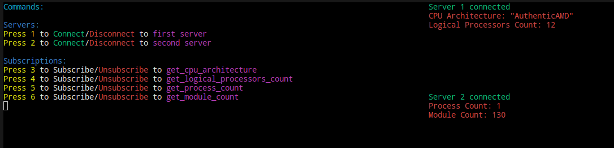

# Multitasking App

This is a multitasking app that communicates with two servers to perform various tasks. The app uses sockets to connect to the servers, sends commands, and reads their responses. The app is written in C and uses Docker for creating isolated environments.

## Installation and Setup <sup><sub>(tested on Linux)</sub></sup>

1. Install Make, Docker and Docker Compose if they are not already installed on your system.

2. Clone the project repository:

```bash
git clone https://github.com/Djama1GIT/multitasking-app.git
cd multitasking-app
```
3. Start the project:

```bash
make build
```

```bash
make run-servers
```

```bash
make run-client
```

## User Interface

Console:)



## Technologies Used

- C - The programming language used for the project.
- Socket - Socket is a computer communications protocol, providing simultaneous two-way communication channels over a single Transmission Control Protocol connection.
- Docker - A platform used in the project for creating, deploying, and managing containers, allowing the application to run in an isolated environment.
